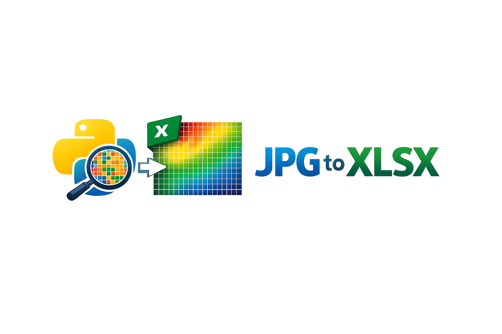

<div align="center">



# jpg2xlsx

### Turn any image into an Excel spreadsheet where every cell becomes a pixel

Create surprisingly visual `.xlsx` files from JPG, PNG, BMP, GIF, and other raster images supported by Pillow.

[](https://pypi.org/project/jpg2xlsx/)
[](https://pypi.org/project/jpg2xlsx/)
[](https://github.com/Tlaloc-Es/jpg2xlsx/actions/workflows/test.yml)
[](https://pepy.tech/project/jpg2xlsx)
[](https://github.com/Tlaloc-Es/jpg2xlsx/stargazers)
[](LICENSE)
[](<https://twitter.com/intent/tweet?text=Turn%20images%20into%20Excel%20pixel%20art%20with%20jpg2xlsx.%20Convert%20JPG%20or%20PNG%20files%20into%20XLSX%20workbooks%20where%20every%20cell%20becomes%20a%20pixel.&url=https://github.com/Tlaloc-Es/jpg2xlsx>)

### From image to spreadsheet art

<p>
  
  
</p>

<p>
  <strong>Before:</strong> a normal image
  <br>
  <strong>After:</strong> the same picture rebuilt as colored Excel cells
</p>

</div>

______________________________________________________________________

`jpg2xlsx` is a small Python CLI and library for generating `.xlsx` files from raster images. It is useful for pixel art experiments, spreadsheet demos, teaching, and weird outputs that are much more eye-catching than a normal spreadsheet should be.

## Why this exists

- Converts images into native Excel workbooks.
- Works as both a CLI and an importable Python package.
- Uses a simple `src/` layout, `uv`, `ruff`, tests, and GitHub Actions.
- Supports JPEG, PNG, BMP, GIF, and other formats that Pillow can read.

______________________________________________________________________

## Install

### With uv

```bash
uv tool install jpg2xlsx
```

### With pip

```bash
pip install jpg2xlsx
```

______________________________________________________________________

## CLI usage

Convert an image and write `output.xlsx`:

```bash
jpg2xlsx input.jpg output.xlsx
```

If you omit the output path, the tool writes next to the input file using the same stem:

```bash
jpg2xlsx assets/pixel-cat.png
```

Useful options:

```bash
jpg2xlsx input.png output.xlsx --cell-width 0.18 --cell-height 1.6 --overwrite
```

### Compact large exports

This project writes one Excel cell per image pixel. That means file size grows quickly with image dimensions.

- A `512x512` image becomes `262,144` formatted cells.
- More cells means more worksheet XML inside the `.xlsx` file.
- More unique colors usually means more cell formats too.

So a large image producing a workbook around `1.5 MB` is not unusual for this output model.

If you want smaller `.xlsx` files, reduce one or both of these before export:

- Total pixels with `--max-dimension`
- Color variety with `--colors`

Recommended commands:

```bash
jpg2xlsx image.png output.xlsx --max-dimension 256 --colors 64
```

```bash
jpg2xlsx image.png output.xlsx --max-dimension 128 --colors 32
```

```bash
jpg2xlsx image.png output.xlsx --max-dimension 384 --colors 128
```

Practical guidance:

- Use `--max-dimension 128 --colors 32` when file size matters more than fidelity.
- Use `--max-dimension 256 --colors 64` as a balanced default for big images.
- Use `--max-dimension 384 --colors 128` when you want to preserve more detail.

Option reference:

- `--max-dimension`: downscales the image so its largest side matches the given value before generating the workbook.
- `--colors`: reduces the image palette to the given number of colors, from `1` to `256`.

Run help:

```bash
jpg2xlsx --help
```

______________________________________________________________________

## Running in development

If you are running from the source tree, prefer module or script entrypoint execution instead of calling the package directory directly.

Correct:

```bash
uv run jpg2xlsx input.png output.xlsx
```

```bash
uv run python -m jpg2xlsx input.png output.xlsx
```

Incorrect:

```bash
uv run python src/jpg2xlsx
```

That direct directory execution does not establish package context correctly in Python, so relative imports can fail.

______________________________________________________________________

## Python usage

```python
from jpg2xlsx import convert

convert("input.jpg", "output.xlsx")
```

You can also use the compacting options from Python:

```python
from jpg2xlsx import convert

convert(
    "input.jpg",
    "output.xlsx",
    max_dimension=256,
    colors=64,
)
```

______________________________________________________________________

## Development

```bash
uv sync --all-groups
uv run ruff check .
uv run ruff format --check .
uv run pytest
```

______________________________________________________________________

## Release flow

- CI runs lint, tests, and package builds on pushes and pull requests.
- Version bump workflows use Commitizen and update the changelog.
- Publish workflows build with `uv` and upload to PyPI or TestPyPI.

______________________________________________________________________

## Contributing

See [CONTRIBUTING.md](CONTRIBUTING.md) for local setup and contribution guidelines.

## Security

See [SECURITY.md](SECURITY.md) for vulnerability reporting.

## License

This project is licensed under the MIT License.

______________________________________________________________________

<div align="center">

## ⭐ If jpg2xlsx made you smile, a star helps others discover it

[](https://github.com/Tlaloc-Es/jpg2xlsx/stargazers)

[⭐ Star on GitHub](https://github.com/Tlaloc-Es/jpg2xlsx)

</div>

______________________________________________________________________

## Star History

[](https://www.star-history.com/#Tlaloc-Es/jpg2xlsx&type=date&legend=bottom-right)
<div align="center">


# jpg2xlsx

### Turn any image into an Excel spreadsheet where every cell becomes a pixel

Create surprisingly visual `.xlsx` files from JPG, PNG, BMP, GIF, and other raster images supported by Pillow.

[](https://pypi.org/project/jpg2xlsx/)
[](https://pypi.org/project/jpg2xlsx/)
[](https://github.com/Tlaloc-Es/jpg2xlsx/actions/workflows/test.yml)
[](https://pepy.tech/project/jpg2xlsx)
[](https://github.com/Tlaloc-Es/jpg2xlsx/stargazers)
[](LICENSE)
[](<https://twitter.com/intent/tweet?text=Turn%20images%20into%20Excel%20pixel%20art%20with%20jpg2xlsx.%20Convert%20JPG%20or%20PNG%20files%20into%20XLSX%20workbooks%20where%20every%20cell%20becomes%20a%20pixel.&url=https://github.com/Tlaloc-Es/jpg2xlsx>)

### From image to spreadsheet art

<p>
  
  
</p>

<p>
  <strong>Before:</strong> a normal image
  <br>
  <strong>After:</strong> the same picture rebuilt as colored Excel cells
</p>

</div>

______________________________________________________________________

`jpg2xlsx` is a small Python CLI and library for generating `.xlsx` files from raster images. It is useful for pixel art experiments, spreadsheet demos, teaching, and weird outputs that are much more eye-catching than a normal spreadsheet should be.

## Why this exists

- Converts images into native Excel workbooks.
- Works as both a CLI and an importable Python package.
- Uses a simple `src/` layout, `uv`, `ruff`, tests, and GitHub Actions.
- Supports JPEG, PNG, BMP, GIF, and other formats that Pillow can read.

______________________________________________________________________

## Install

### With uv

```bash
uv tool install jpg2xlsx
```

### With pip

```bash
pip install jpg2xlsx
```

______________________________________________________________________

## CLI usage

Convert an image and write `output.xlsx`:

```bash
jpg2xlsx input.jpg output.xlsx
```

If you omit the output path, the tool writes next to the input file using the same stem:

```bash
jpg2xlsx assets/pixel-cat.png
```

Useful options:

```bash
jpg2xlsx input.png output.xlsx --cell-width 0.18 --cell-height 1.6 --overwrite
```

### Compact large exports

This project writes one Excel cell per image pixel. That means file size grows quickly with image dimensions.

- A `512x512` image becomes `262,144` formatted cells.
- More cells means more worksheet XML inside the `.xlsx` file.
- More unique colors usually means more cell formats too.

So a large image producing a workbook around `1.5 MB` is not unusual for this output model.

If you want smaller `.xlsx` files, reduce one or both of these before export:

- Total pixels with `--max-dimension`
- Color variety with `--colors`

Recommended commands:

```bash
jpg2xlsx image.png output.xlsx --max-dimension 256 --colors 64
```

```bash
jpg2xlsx image.png output.xlsx --max-dimension 128 --colors 32
```

```bash
jpg2xlsx image.png output.xlsx --max-dimension 384 --colors 128
```

Practical guidance:

- Use `--max-dimension 128 --colors 32` when file size matters more than fidelity.
- Use `--max-dimension 256 --colors 64` as a balanced default for big images.
- Use `--max-dimension 384 --colors 128` when you want to preserve more detail.

Option reference:

- `--max-dimension`: downscales the image so its largest side matches the given value before generating the workbook.
- `--colors`: reduces the image palette to the given number of colors, from `1` to `256`.

Run help:

```bash
jpg2xlsx --help
```

______________________________________________________________________

## Running in development

If you are running from the source tree, prefer module or script entrypoint execution instead of calling the package directory directly.

Correct:

```bash
uv run jpg2xlsx input.png output.xlsx
```

```bash
uv run python -m jpg2xlsx input.png output.xlsx
```

Incorrect:

```bash
uv run python src/jpg2xlsx
```

That direct directory execution does not establish package context correctly in Python, so relative imports can fail.

______________________________________________________________________

## Python usage

```python
from jpg2xlsx import convert

convert("input.jpg", "output.xlsx")
```

You can also use the compacting options from Python:

```python
from jpg2xlsx import convert

convert(
	"input.jpg",
	"output.xlsx",
	max_dimension=256,
	colors=64,
)
```

______________________________________________________________________

## Development

```bash
uv sync --all-groups
uv run ruff check .
uv run ruff format --check .
uv run pytest
```

______________________________________________________________________

## Release flow

- CI runs lint, tests, and package builds on pushes and pull requests.
- Version bump workflows use Commitizen and update the changelog.
- Publish workflows build with `uv` and upload to PyPI or TestPyPI.

______________________________________________________________________

## Contributing

See [CONTRIBUTING.md](CONTRIBUTING.md) for local setup and contribution guidelines.

## Security

See [SECURITY.md](SECURITY.md) for vulnerability reporting.

## License

This project is licensed under the MIT License.

______________________________________________________________________

<div align="center">

## ⭐ If jpg2xlsx made you smile, a star helps others discover it

[](https://github.com/Tlaloc-Es/jpg2xlsx/stargazers)

[⭐ Star on GitHub](https://github.com/Tlaloc-Es/jpg2xlsx)

</div>

______________________________________________________________________

## Star History

[](https://www.star-history.com/#Tlaloc-Es/jpg2xlsx&type=date&legend=bottom-right)

